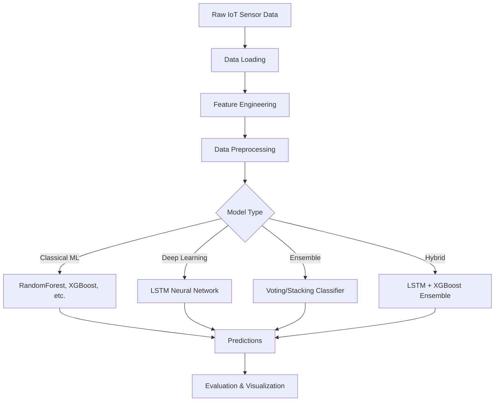

# IoT Anomaly Detection - API Documentation

This document describes the programming interface (API) for the IoT Anomaly Detection system. The API provides a clean, high-level interface for working with IoT sensor data, training models, and making predictions.

## Table of Contents

- [Overview](#overview)
- [Architecture](#architecture)
- [Core Components](#core-components)
- [API Reference](#api-reference)
- [Usage Examples](#usage-examples)

## Overview

The IoT Anomaly Detection API is designed to be:
- **Simple**: Minimal code to get started
- **Flexible**: Support multiple use cases and model types
- **Production-ready**: Includes model persistence, logging, and error handling
- **Extensible**: Easy to add new models and features

### Key Features

- Automated feature engineering from raw sensor data
- Support for 12+ machine learning models
- Hybrid deep learning (LSTM + XGBoost) ensemble
- K-fold cross-validation for robust evaluation
- Comprehensive visualization tools
- Model persistence and loading

## Architecture



## Core Components

### 1. IoTAnomalyDetector Class

The main interface for the anomaly detection pipeline.

**Purpose**: Provides end-to-end workflow for loading data, preparing features, training models, and making predictions.

**Location**: `iot_anomaly_utils.py`

### 2. Feature Engineering Module

**Purpose**: Transforms raw sensor readings into engineered features.

**Location**: `scripts/feature_engineering.py`

**Features Generated**:
- Basic transformations (squared, sqrt, log)
- Per-machine z-scores
- Rolling window statistics (mean, std, ewm)
- Rate of change features
- Interaction terms
- Temporal encodings (hour, day of week)
- Anomaly deviation scores

### 3. Model Training Scripts

**Classical Models** (`scripts/train_models_kfold.py`):
- 10 classification models
- 6 regression models
- 2 ensemble models
- K-fold cross-validation
- Automatic best model selection

**Hybrid Model** (`scripts/train_lstm_xgb_ensemble.py`):
- LSTM neural network for temporal patterns
- XGBoost for tabular features
- Ensemble combination
- GPU support

### 4. Visualization Tools

**Location**: `scripts/create_visualizations.py`

**Capabilities**:
- Model performance comparisons
- Training time analysis
- Best model summaries
- Feature importance plots

## API Reference

### Class: IoTAnomalyDetector

#### Constructor

```python
detector = IoTAnomalyDetector()
```

Creates a new instance of the anomaly detector.

#### Methods

##### load_data

```python
detector.load_data(filepath: str, sample_size: Optional[int] = None) -> pd.DataFrame
```

Load raw IoT sensor data from CSV.

**Parameters**:
- `filepath`: Path to CSV file containing sensor data
- `sample_size`: Optional number of rows to sample for faster prototyping

**Returns**: pandas DataFrame with loaded data

**Example**:
```python
df = detector.load_data("data/smart_manufacturing_data.csv", sample_size=10000)
```

---

##### prepare_features

```python
detector.prepare_features(target_col: str = "anomaly_flag") -> pd.DataFrame
```

Compute engineered features from raw sensor data.

**Parameters**:
- `target_col`: Name of the target column to predict

**Returns**: pandas DataFrame with engineered features

**Example**:
```python
df_features = detector.prepare_features(target_col="anomaly_flag")
```

---

##### prepare_train_test_split

```python
detector.prepare_train_test_split(
    target_col: str = "anomaly_flag",
    test_size: float = 0.2,
    scale: bool = True,
    stratify: bool = True
) -> Tuple[np.ndarray, np.ndarray, np.ndarray, np.ndarray]
```

Split data into training and testing sets.

**Parameters**:
- `target_col`: Target column name
- `test_size`: Fraction of data for testing (0.0 to 1.0)
- `scale`: Whether to standardize features using StandardScaler
- `stratify`: Whether to stratify the split (for classification)

**Returns**: Tuple of (X_train, X_test, y_train, y_test)

**Example**:
```python
X_train, X_test, y_train, y_test = detector.prepare_train_test_split(
    target_col="anomaly_flag",
    test_size=0.2,
    scale=True
)
```

---

##### load_model

```python
detector.load_model(model_path: str)
```

Load a trained model from disk.

**Parameters**:
- `model_path`: Path to saved model file (.pkl)

**Example**:
```python
detector.load_model("models/best_anomaly_model.pkl")
```

---

##### save_model

```python
detector.save_model(model_path: str)
```

Save the current model to disk.

**Parameters**:
- `model_path`: Path where model should be saved (.pkl)

**Example**:
```python
detector.save_model("models/my_model.pkl")
```

---

##### predict

```python
detector.predict(X: np.ndarray) -> np.ndarray
```

Make predictions using the loaded model.

**Parameters**:
- `X`: Feature matrix (numpy array)

**Returns**: Array of predictions

**Example**:
```python
predictions = detector.predict(X_test)
```

---

##### evaluate_classification

```python
detector.evaluate_classification(
    y_true: np.ndarray,
    y_pred: np.ndarray,
    labels: Optional[List[str]] = None
) -> Dict[str, float]
```

Evaluate classification model performance.

**Parameters**:
- `y_true`: True labels
- `y_pred`: Predicted labels
- `labels`: Optional class labels for display

**Returns**: Dictionary containing accuracy, precision, recall, and F1 score

**Example**:
```python
metrics = detector.evaluate_classification(y_test, predictions)
print(f"F1 Score: {metrics['f1']:.4f}")
```

---

##### evaluate_regression

```python
detector.evaluate_regression(
    y_true: np.ndarray,
    y_pred: np.ndarray
) -> Dict[str, float]
```

Evaluate regression model performance.

**Parameters**:
- `y_true`: True values
- `y_pred`: Predicted values

**Returns**: Dictionary containing MAE, RMSE, and R² score

**Example**:
```python
metrics = detector.evaluate_regression(y_test, predictions)
print(f"R² Score: {metrics['r2']:.4f}")
```

---

##### plot_confusion_matrix

```python
detector.plot_confusion_matrix(
    y_true: np.ndarray,
    y_pred: np.ndarray,
    labels: Optional[List[str]] = None,
    figsize: Tuple[int, int] = (8, 6)
) -> plt.Figure
```

Plot confusion matrix for classification results.

**Parameters**:
- `y_true`: True labels
- `y_pred`: Predicted labels
- `labels`: Class labels for display
- `figsize`: Figure size tuple

**Returns**: matplotlib Figure object

**Example**:
```python
fig = detector.plot_confusion_matrix(y_test, predictions, labels=['Normal', 'Anomaly'])
plt.show()
```

---

##### plot_feature_importance

```python
detector.plot_feature_importance(
    top_n: int = 20,
    figsize: Tuple[int, int] = (10, 8)
) -> plt.Figure
```

Plot feature importance from tree-based models.

**Parameters**:
- `top_n`: Number of top features to display
- `figsize`: Figure size tuple

**Returns**: matplotlib Figure object

**Example**:
```python
fig = detector.plot_feature_importance(top_n=20)
plt.show()
```

---

### Utility Functions

#### load_results

```python
load_results(results_dir: str = "results") -> Dict[str, pd.DataFrame]
```

Load all training result CSV files.

**Parameters**:
- `results_dir`: Directory containing result CSV files

**Returns**: Dictionary mapping task names to result DataFrames

**Example**:
```python
from iot_anomaly_utils import load_results

results = load_results("results")
for task, df in results.items():
    print(f"{task}: {len(df)} models")
```

---

#### plot_model_comparison

```python
plot_model_comparison(
    results: pd.DataFrame,
    metric: str = 'f1_mean',
    title: str = 'Model Comparison',
    figsize: Tuple[int, int] = (12, 6)
) -> plt.Figure
```

Create comparison plot of model performances.

**Parameters**:
- `results`: Results DataFrame from training
- `metric`: Metric to plot
- `title`: Plot title
- `figsize`: Figure size tuple

**Returns**: matplotlib Figure object

**Example**:
```python
from iot_anomaly_utils import load_results, plot_model_comparison

results = load_results()
fig = plot_model_comparison(results['anomaly'], metric='f1_mean')
plt.show()
```

---

#### generate_summary_report

```python
generate_summary_report(
    results_dir: str = "results",
    output_file: str = "summary_report.txt"
)
```

Generate a text summary report of all results.

**Parameters**:
- `results_dir`: Directory containing results
- `output_file`: Path for output text file

**Example**:
```python
from iot_anomaly_utils import generate_summary_report

generate_summary_report("results", "my_summary.txt")
```

---

#### quick_predict

```python
quick_predict(
    data_path: str,
    model_path: str,
    target_col: str = "anomaly_flag"
) -> np.ndarray
```

Convenience function for quick predictions on new data.

**Parameters**:
- `data_path`: Path to CSV data file
- `model_path`: Path to saved model
- `target_col`: Target column name

**Returns**: Array of predictions

**Example**:
```python
from iot_anomaly_utils import quick_predict

predictions = quick_predict(
    "data/new_data.csv",
    "models/best_anomaly_model.pkl",
    "anomaly_flag"
)
```

---

## Usage Examples

### Example 1: Simple Anomaly Detection Workflow

```python
from iot_anomaly_utils import IoTAnomalyDetector

# Initialize detector
detector = IoTAnomalyDetector()

# Load and prepare data
detector.load_data("data/smart_manufacturing_data.csv")
detector.prepare_features("anomaly_flag")
X_train, X_test, y_train, y_test = detector.prepare_train_test_split()

# Load pre-trained model
detector.load_model("models/best_anomaly_model.pkl")

# Make predictions
predictions = detector.predict(X_test)

# Evaluate
metrics = detector.evaluate_classification(y_test, predictions)
print(f"F1 Score: {metrics['f1']:.4f}")
```

### Example 2: Training Custom Model

```python
from iot_anomaly_utils import IoTAnomalyDetector
from sklearn.ensemble import RandomForestClassifier

# Prepare data
detector = IoTAnomalyDetector()
detector.load_data("data/smart_manufacturing_data.csv", sample_size=5000)
detector.prepare_features("maintenance_required")
X_train, X_test, y_train, y_test = detector.prepare_train_test_split(
    target_col="maintenance_required"
)

# Train custom model
model = RandomForestClassifier(n_estimators=100, random_state=42)
model.fit(X_train, y_train)

# Assign to detector
detector.model = model

# Evaluate
predictions = detector.predict(X_test)
metrics = detector.evaluate_classification(y_test, predictions)

# Save model
detector.save_model("models/my_custom_model.pkl")
```

### Example 3: Complete Analysis with Visualization

```python
from iot_anomaly_utils import IoTAnomalyDetector
import matplotlib.pyplot as plt

# Setup
detector = IoTAnomalyDetector()
detector.load_data("data/smart_manufacturing_data.csv")
detector.prepare_features("anomaly_flag")
X_train, X_test, y_train, y_test = detector.prepare_train_test_split()

# Load model and predict
detector.load_model("models/best_anomaly_model.pkl")
predictions = detector.predict(X_test)

# Evaluate
metrics = detector.evaluate_classification(y_test, predictions)

# Visualizations
fig1 = detector.plot_confusion_matrix(y_test, predictions,
                                      labels=['Normal', 'Anomaly'])
plt.savefig("charts/confusion_matrix.png")

fig2 = detector.plot_feature_importance(top_n=15)
plt.savefig("charts/feature_importance.png")

plt.show()
```

## Data Format

### Input Data Requirements

The input CSV file must contain the following columns:

- `timestamp`: Timestamp of the reading (datetime format)
- `machine_id`: Unique identifier for the machine (integer)
- `temperature`: Temperature sensor reading (float)
- `vibration`: Vibration sensor reading (float)
- `humidity`: Humidity sensor reading (float)
- `pressure`: Pressure sensor reading (float)
- `energy_consumption`: Energy consumption reading (float)
- `machine_status`: Status code (integer)
- `anomaly_flag`: Binary anomaly indicator (0 or 1)
- `predicted_remaining_life`: Remaining useful life in hours (float)
- `failure_type`: Type of failure (string: "Normal", "Overheating", etc.)
- `downtime_risk`: Risk of downtime (float: 0.0 to 1.0)
- `maintenance_required`: Maintenance flag (0 or 1)

### Output Format

Predictions are returned as numpy arrays with values corresponding to the task:
- **Binary classification**: 0 or 1
- **Multi-class classification**: Integer class labels
- **Regression**: Floating point values

## Error Handling

The API includes comprehensive error checking:

```python
try:
    detector = IoTAnomalyDetector()
    detector.load_data("data/nonexistent.csv")
except FileNotFoundError:
    print("Data file not found")

try:
    predictions = detector.predict(X_test)
except ValueError as e:
    print(f"Error: {e}")  # "Load a model first using load_model()"
```

## Best Practices

1. **Always scale features** for classical ML models (set `scale=True`)
2. **Use stratified splits** for imbalanced classification tasks
3. **Save models** after training for reuse
4. **Validate** on held-out test data before deployment
5. **Monitor** feature distributions for data drift
6. **Version** your models with meaningful names (e.g., `anomaly_v1_20250109.pkl`)

## Performance Considerations

- **Sampling**: Use `sample_size` parameter during development for faster iteration
- **Feature Engineering**: Can be computationally expensive; cache results when possible
- **Model Loading**: Load models once and reuse for multiple predictions
- **Batch Predictions**: Process data in batches for better throughput

## Next Steps

- See [iot_anomaly.example.md](iot_anomaly.example.md) for complete end-to-end examples
- Review [iot_anomaly.API.ipynb](iot_anomaly.API.ipynb) for interactive notebook examples
- Check [report/report.md](report/report.md) for detailed project documentation
